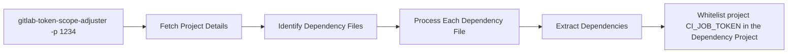

<div align="center">

# GitLab CI Job Token Scope Adjuster


[](https://codecov.io/github/shini4i/gitlab-token-scope-adjuster)


</div>

This CLI tool helps automate the process of configuring CI job token scopes in GitLab projects.

Starting from GitLab 16, it is mandatory to explicitly configure `CI_JOB_TOKEN` access, and this tool simplifies that by
automating the necessary API calls.

## How it works?

- Fetches project details from GitLab.
- Identifies dependency files (`go.mod`, `composer.json`, `package-lock.json`) in the repository.
- Extracts dependencies from these files.
- Configures CI job token scopes to whitelist the source project in dependency projects.



## Prerequisites

- Node.js (>= 22.x)
- GitLab access token with the necessary permissions

## Installation

Install [@shini4i/gitlab-token-scope-adjuster](https://www.npmjs.com/package/@shini4i/gitlab-token-scope-adjuster) package:

```sh
npm install -g @shini4i/gitlab-token-scope-adjuster
```

## Usage

Expose the following environment variables:

```sh
export GITLAB_URL=https://gitlab.example.com
export GITLAB_TOKEN=your_access_token
```

And run the following command:

```sh
gitlab-token-scope-adjuster -p <your_project_id>
```

> `--project-id/-p` and `--all` are mutually exclusive. Make sure to specify exactly one of them when running the CLI.

To find dependency files recursively run the following command:
```sh
gitlab-token-scope-adjuster -p <your_project_id> --monorepo
```

Keep in mind that depending on the amount of files in the repo it can significantly increase execution time.

### Process every accessible project

You can iterate over every project visible to the provided token:

```sh
gitlab-token-scope-adjuster --all
```

Combine the `--all` mode with `--dry-run` (and optionally `--report`) whenever you only need a preview of the changes:

```sh
gitlab-token-scope-adjuster --all --dry-run --report # writes gitlab-token-scope-report.yaml
gitlab-token-scope-adjuster --all --dry-run --report reports/output.yaml
```

### CLI options

- `-p, --project-id <id>` – process a single project by ID (required when `--all` is not supplied).
- `--dry-run` – list dependency projects without adjusting scopes.
- `--monorepo` – recurse through the repository tree when looking for dependency manifests.
- `--all` – process every project the token can access instead of a single `--project-id`.
- `--report [path]` – persist dry-run results for `--all` mode as YAML (defaults to `gitlab-token-scope-report.yaml`).

## Local development

`ts-node` is required only when running the CLI directly from source during development. After cloning the repository:

You can exercise the CLI directly from the repository without installing globally:

```sh
npm exec ts-node -- src/cli.ts --project-id <project_id> --dry-run
npm exec ts-node -- src/cli.ts --all --dry-run --report reports/dry-run.yaml
```

For faster subsequent runs:

```sh
npm run build
node dist/cli.js --all --dry-run --report
```

The Makefile includes shortcuts such as `make dry-run-all` to execute `--all --dry-run` via ts-node.

## Testing

Run the automated test suites:

```sh
npm test
```

To generate a coverage report:

```sh
npm run coverage
```

The Makefile also exposes `make test` and `make test-coverage` targets if you prefer invoking tests through make.

## Contributing

Pull requests are welcome. For major changes, please open an issue first to discuss what you would like to change.

If you discover a bug or have an idea for an enhancement, feel free to [open an issue](https://github.com/shini4i/gitlab-token-scope-adjuster/issues).

## License

This project is released under the [MIT License](./LICENSE).
